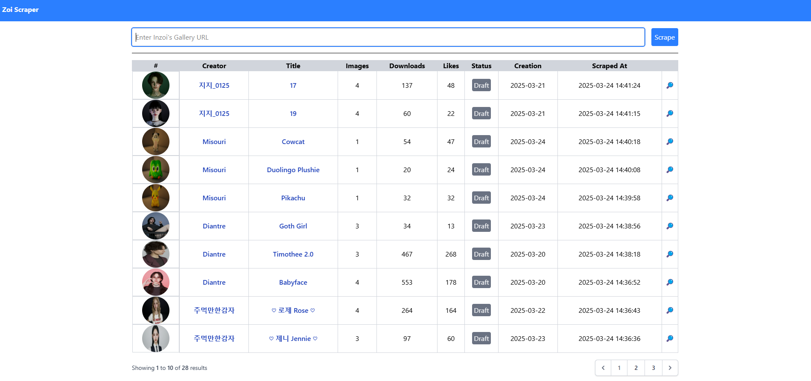
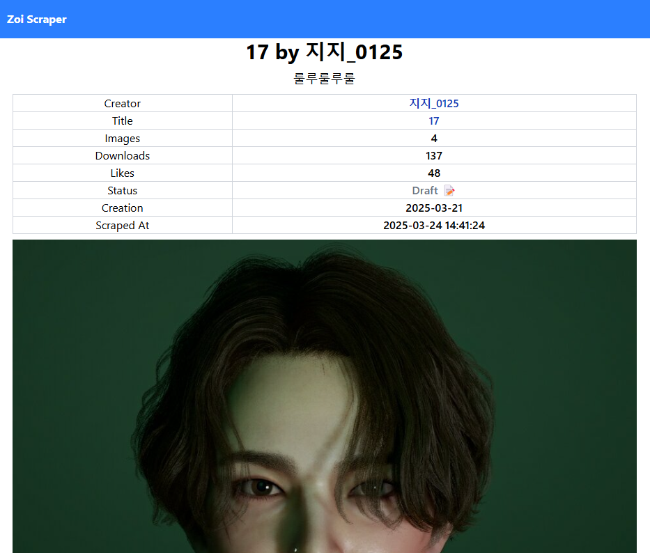
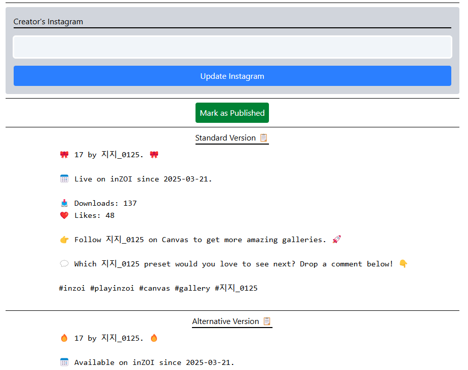
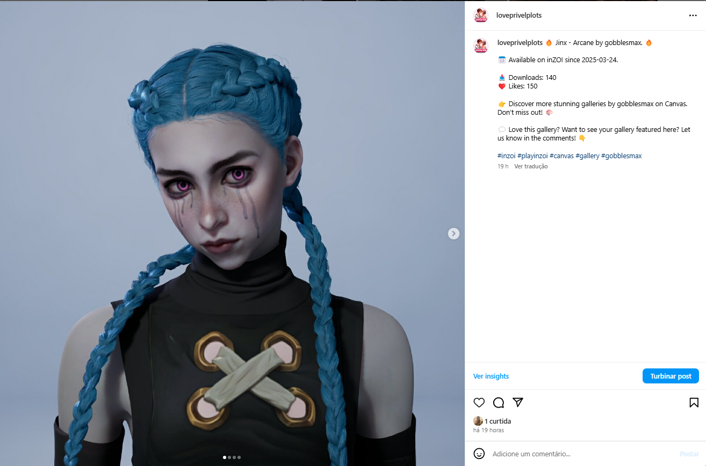

# inZOI Canvas App

Scrap inZOI Canvas' Gallery assets and details and get it ready for publishing on Instagram/Threads.

## Requirements

- PHP 8.2 or higher
 - ext-curl, ext-json, ext-zip
- Composer
- Chrome Webdriver - (link)[https://developer.chrome.com/docs/chromedriver/downloads?hl=pt-br]

## Installation

1. Clone the repository
2. Run `composer install`
3. Run `cp .env.example .env`
4. Run `php artisan key:generate`
5. Update the `.env` file with the expected configuration
6. Run `php artisan migrate`
7. Run `php artisan serve`
8. Open the browser and navigate to `http://localhost:8000`

## Resources

- [Laravel](https://laravel.com/docs/8.x)
- [Tailwind CSS](https://tailwindcss.com/docs)
- [Google Webdriver](https://developer.chrome.com/docs/chromedriver/downloads?hl=pt-br)

## Firefox Webdriver
geckodriver --log trace --port=4444

## Chrome Webdriver
chromedriver.exe --port=9515 --verbose

## Images

